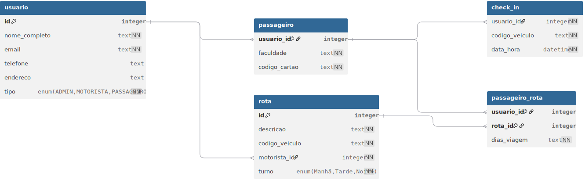
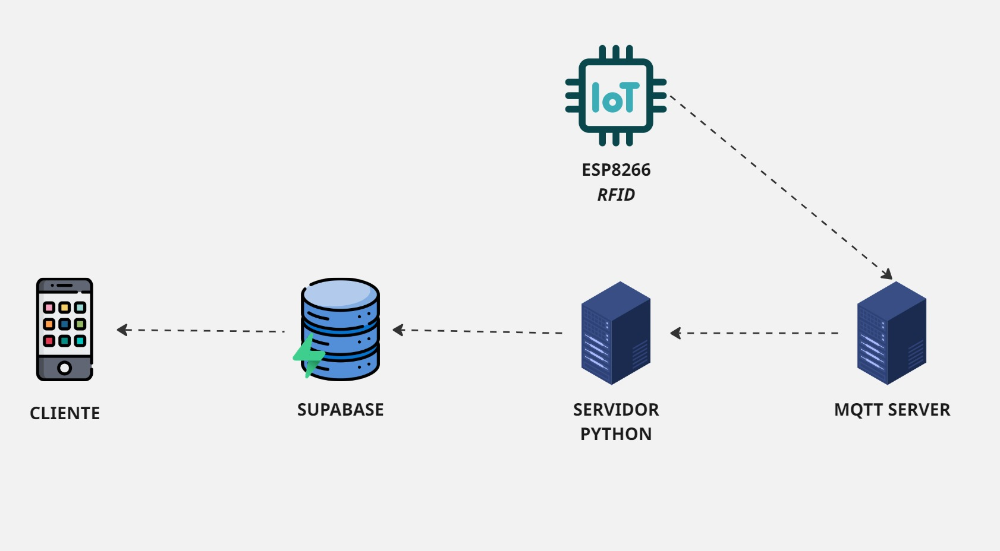

# BusCheck
Aplicativo mobile (Android) para organização de viagens de ônibus privados, conectando estudantes do interior às faculdades na cidade.

## Requisitos Funcionais

Administrador
   - Deve ser capaz de cadastrar novas rotas de viagem, incluindo turno e veiculo
   - Deve poder visualizar todas as rotas cadastradas
   - Deve poder editar informações de rotas existentes
   - Deve poder desativar/reativar rotas conforme necessário

Passageiro
   - Deve poder criar uma conta de usuário com informações pessoais
   - Deve poder vincular-se a uma instituição de ensino (faculdade/universidade)
   - Deve poder visualizar todas as rotas cadastradas
   - Deve poder inscrever-se em uma rota de viagem disponível
   - Deve poder selecionar os dias da semana em que utilizará o transporte
   - Deve poder visualizar suas inscrições ativas e histórico de viagens
   - Deve poder marcar quando pretender faltar na viagem.
   - Deve poder confirmar presença nas viagens (check-in)

Motorista
   - Deve poder visualizar a lista completa de rotas em que está vinculado
   - Deve poder acessar detalhes específicos de cada rota (horário, passageiros)
   - Deve poder visualizar a lista de alunos inscritos em cada rota
   - Deve poder verificar informações de cada aluno (nome, faculdade, cidade de origem)
   - Deve poder visualizar em tempo real quais alunos já estão a bordo do transporte

## Requisitos Não Funcionais

- Um usuário do tipo passageiro não pode se inscever na mesma rota mais de uma vez.
- O código de cartão deve ser único para cada passageiro.
- Um usuário do tipo motorista não pode se inscever em uma rota.
- Um usuário do tipo admin não pode se inscever em uma rota.

## ERD - Diagram de Entidades e Relacionamentos

## Telas

**1. Autênticação**
   - Login: permite ao usuário entrar como email e senha
   - Cadastro: permite que o usuário se cadastre no sistema.
   - Perfil: premite visualizar as informações do usuário.

**2. Passageiro**
   -  Rotas cadastradas: permite visualizar as rotas em que ele está cadastrado
   - Cadastar-se em uma rota: permite se cadastar para utilizar uma rota.
   -  Informar ausência: permite ao usuário informar que não usará o transpote em um dia espessifico.
   - Histórico de check-in

**3. Motorista**
   - Rotas cadastradas: permite visualizar as rotas em que ele está cadastrado
   - Detalhes da rota: permite visualizar as informações da rota
   - lista de presença da rota: permite visualizar a lista de alunos que utilizarão o trasporte no dia.

**3. Motorista**
   - Rotas cadastradas: permite visualizar todas as rotas cadastradas no sistema
   - Detalhes da rota: permite visualizar as informações da rota

   

## Arquitetura

